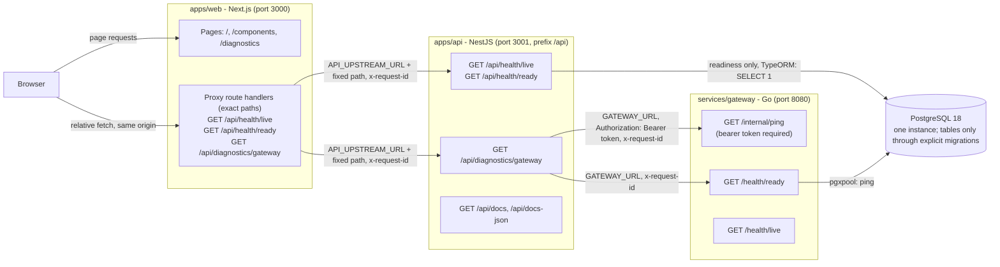

# Starter architecture

This document describes the wiring of the starter baseline: three small applications, one
database and the connections between them. Product modules are added on top of it during the
implementation phase. Each one is recorded in [Product modules](#product-modules) when its first
code lands, so the document keeps describing what exists. Sections other than that one describe the
baseline.

## Wiring



Facts the diagram encodes:

- The browser talks only to the web app. The web server forwards three fixed GET paths to the API;
  it is not a general proxy and forwards no caller-supplied host, path, query, cookie or header
  (except a validated request id).
- The API is the only caller of the gateway. `GATEWAY_SERVICE_TOKEN` is held by the API and the
  gateway only. The web app, its container and the browser never receive it: Compose does not pass
  it to the `web` container, and the development runner removes it and every `POSTGRES_*` variable
  from the environment of the web process.
- Both backends connect to the same PostgreSQL instance with the same `POSTGRES_*` variables. The
  API uses TypeORM, the gateway a pgx connection pool. Neither creates tables.
- Swagger UI and the two gateway health routes are reachable directly on the host in host
  development. In full-container mode the gateway is not published.

Host names per run mode:

| Link           | Host development        | Full-container mode   |
| -------------- | ----------------------- | --------------------- |
| web to API     | `http://localhost:3001` | `http://api:3001`     |
| API to gateway | `http://localhost:8080` | `http://gateway:8080` |
| backends to DB | `localhost:5432`        | `postgres:5432`       |

## Request id flow

The header is `x-request-id` (constant `REQUEST_ID_HEADER` in `@workspace/contracts`).

1. Each hop accepts an inbound id only if it matches `^[A-Za-z0-9._-]{1,64}$`. Anything else is
   replaced by a newly generated id, so unvalidated input never reaches logs.
2. The web proxy resolves the id, sends it to the API and returns the id the API answered with.
3. The API middleware stores the id on the request, echoes it on the response, writes it to the
   access log and includes it in `GatewayDiagnosticsResponse.requestId` and in every error envelope.
4. The API sends the same id on both gateway calls. The gateway echoes it and attaches it to its
   log lines as `request_id`.

One id can therefore be followed from the browser's response header through the logs of all three
processes. The diagnostics page displays it. `pnpm smoke` checks that the API, the web proxy and
the gateway echo a supplied id.

## Health and diagnostics semantics

| Endpoint                       | Checks                                                                                                                | Never depends on       |
| ------------------------------ | --------------------------------------------------------------------------------------------------------------------- | ---------------------- |
| API `/api/health/live`         | The process answers.                                                                                                  | PostgreSQL, gateway    |
| API `/api/health/ready`        | Read-only `SELECT 1` on its own pooled connection, bounded by `DATABASE_TIMEOUT_MS`.                                  | gateway                |
| API `/api/diagnostics/gateway` | Authenticated `/internal/ping` and `/health/ready` of the gateway, in parallel, each bounded by `GATEWAY_TIMEOUT_MS`. | the API's own database |
| Gateway `/health/live`         | The process answers.                                                                                                  | PostgreSQL             |
| Gateway `/health/ready`        | Pool ping, bounded by `DATABASE_TIMEOUT_MS`.                                                                          | API                    |
| Gateway `/internal/ping`       | A valid bearer token. Proves authenticated reachability only.                                                         | PostgreSQL             |

Both backends start while PostgreSQL is down. The API connects in the background with capped
exponential backoff (1 s up to 15 s); the gateway pool connects lazily. Readiness turns to 200
without a restart once the database is reachable. The API readiness check takes a dedicated
connection from the pool and, when the check fails or times out, releases it as broken so the pool
discards it; a silently dropped connection therefore cannot use up the pool. All health responses
are sent with `Cache-Control: no-store`, and the web pages that show them are rendered
dynamically, never at build time.

`DATABASE_TIMEOUT_MS` (both backends) and `GATEWAY_TIMEOUT_MS` (API) accept whole milliseconds from
100 to 20000. The upper bound keeps a readiness answer inside the gateway's 30 s write timeout.

Health and diagnostics routes are intentionally public in local development.

### Status mapping

Readiness:

| Endpoint                | Database reachable | HTTP | Body                                                                                             |
| ----------------------- | ------------------ | ---- | ------------------------------------------------------------------------------------------------ |
| API `/api/health/ready` | yes                | 200  | `ApiReadinessResponse`, `status: "ok"`, `details.database.status: "up"`                          |
| API `/api/health/ready` | no                 | 503  | `ApiReadinessResponse`, `status: "error"`, `details.database.status: "down"` and a fixed message |
| Gateway `/health/ready` | yes                | 200  | `ReadinessResponse`, `status: "ok"`, `checks.database.status: "up"`                              |
| Gateway `/health/ready` | no                 | 503  | `ReadinessResponse`, `status: "unavailable"`, `checks.database.message: "database unreachable"`  |

The API readiness messages are fixed texts: `database connection not established`,
`database check timed out` or `database unreachable`. Driver errors, which can name hosts and
users, go to the server log only.

`GET /api/diagnostics/gateway`:

| Reachability (`/internal/ping`)                                                  | Database readiness (`/health/ready`)                                  | HTTP | `status`      |
| -------------------------------------------------------------------------------- | --------------------------------------------------------------------- | ---- | ------------- |
| up                                                                               | up                                                                    | 200  | `ok`          |
| up                                                                               | down (`not_ready`, `timeout`, `unreachable` or `unexpected_response`) | 503  | `degraded`    |
| down, reason `timeout`                                                           | any                                                                   | 504  | `unavailable` |
| down, reason `unreachable`, `unauthorized` (401 or 403) or `unexpected_response` | any                                                                   | 502  | `unavailable` |

The body is always the sanitized `GatewayDiagnosticsResponse` (per check: `status`, `latencyMs`,
optional `upstreamStatus` and `reason`), never the gateway's raw body, its URL, the token or an
error stack. The API does not follow redirects on these calls, so the token cannot travel elsewhere.

Web proxy failures (the proxy's own, when no API answer can be passed through):

| HTTP | `error.code`                | Meaning                                          |
| ---- | --------------------------- | ------------------------------------------------ |
| 500  | `configuration_error`       | `API_UPSTREAM_URL` is missing or invalid         |
| 502  | `upstream_unreachable`      | The API refused or dropped the connection        |
| 502  | `upstream_invalid_response` | The API answered with something that is not JSON |
| 504  | `upstream_timeout`          | No complete answer within 10 seconds             |

Otherwise the proxy passes the API's status code and JSON body through unchanged, so a 503 from
the API stays a 503 in the browser.

## Error envelope

Every failure that is not a health or diagnostics report uses `ErrorResponse` from
`@workspace/contracts`, in the API, the gateway and the web proxy:

```json
{
  "error": { "code": "not_found", "message": "Resource not found" },
  "statusCode": 404,
  "requestId": "3f0c9c2e-...",
  "timestamp": "2026-10-03T12:00:00.000Z",
  "path": "/api/unknown"
}
```

- `error.code` is stable and machine-readable: `bad_request`, `unauthorized`, `forbidden`,
  `not_found`, `method_not_allowed`, `internal_error`, `not_implemented`, plus the proxy codes above.
  For any other status the API derives the code from the HTTP status text, for example 413
  `payload_too_large` for an oversized request body.
- The API honours a client status (400-499) carried by a non-Nest error such as the body parser's;
  every other unknown error, including one that carries a 5xx status of its own, is a 500
  `internal_error`.
- Messages are safe texts. For 5xx responses the detail (including the stack) is written to the
  server log only. Responses never contain stack traces, connection strings, environment values or
  credentials.
- The gateway returns the envelope for unknown paths (404), wrong methods (405), a missing or wrong
  token (401) and recovered panics (500). Requests that Go's `net/http` answers before routing (a
  malformed request line or URI, oversized headers, `OPTIONS *`) get the standard library's plain
  response instead, without the envelope or a request id.

## Contracts and the consistency check

`packages/contracts` is the single definition of every response shape. It is kept in three forms,
with the Go DTOs as the fourth copy on the gateway side:

| Form                | Location                                   | Used by                           |
| ------------------- | ------------------------------------------ | --------------------------------- |
| TypeScript types    | `packages/contracts/src/index.ts`          | web and API (compiled to `dist/`) |
| JSON Schema 2020-12 | `packages/contracts/schemas/*.schema.json` | language-neutral reference        |
| Fixtures            | `packages/contracts/fixtures/*.json`       | tests on both sides               |
| Go DTOs             | `services/gateway/internal/health/dto.go`  | gateway                           |

Shapes: `LivenessResponse`, `ReadinessResponse`, `ApiReadinessResponse`, `GatewayPingResponse`,
`GatewayDiagnosticsResponse`, `ErrorResponse`.

There is no code generation. Drift is caught by three small checks that run in `pnpm verify`:

1. `packages/contracts/test/fixtures.test.ts` validates every fixture against its JSON Schema (Ajv).
   It also holds one typed sample per schema: the sample must satisfy the TypeScript type at
   compile time and be identical to its fixture file at test time, which ties the types to the
   schemas.
2. `services/gateway/internal/health/dto_test.go` decodes the gateway-relevant fixtures into the Go
   DTOs with unknown fields disallowed and re-encodes them, and compares the status and service
   values the handlers emit with those fixtures.
3. The API's Swagger DTO classes implement the contract interfaces, so a changed type that is not
   mirrored fails `pnpm typecheck`.

Limits: the Go tests do not validate responses against the JSON Schemas, so a schema change that no
fixture exercises (for example a new optional property) is not detected and must be mirrored by
hand.

## Configuration validation per service

| Service     | When                     | How                                                                                                 | On failure                                                      |
| ----------- | ------------------------ | --------------------------------------------------------------------------------------------------- | --------------------------------------------------------------- |
| web         | Per proxy request (lazy) | `API_UPSTREAM_URL` must be a plain `http(s)` base URL without credentials, query or fragment.       | 500 `configuration_error`; the value is not returned or logged. |
| API         | At bootstrap             | zod schema in `apps/api/src/config/environment.ts`; empty strings count as unset so defaults apply. | One log line naming missing and invalid variables, exit code 1. |
| gateway     | At process start         | `services/gateway/internal/config`; all problems are collected.                                     | One JSON log line naming the variables, exit code 1.            |
| TypeORM CLI | Per migration command    | The database part of the same zod schema (`databaseEnvironmentSchema`).                             | Message naming the missing variables, exit code 1.              |

Importing modules and building never validates configuration: `pnpm build` and the image builds
work with no `.env`, no database and no running service. Variable names, defaults and readers are
listed in the README.

## Modules and packages

### `apps/web`

| Path             | Purpose                                                                                                                                                                                       |
| ---------------- | --------------------------------------------------------------------------------------------------------------------------------------------------------------------------------------------- |
| `scripts`        | Node launchers behind the `dev` and `start` package scripts (`next dev` on `WEB_PORT`; standalone server on `WEB_PORT` / `WEB_HOST`). No shell syntax.                                        |
| `src/app`        | The three pages, the root layout and the three proxy route handlers under `src/app/api`.                                                                                                      |
| `src/components` | App-level navigation used by the shell.                                                                                                                                                       |
| `src/lib`        | Browser-safe helpers: `fetch-json.ts` (typed, relative URLs only, timeout, every failure returned as a value) and `service-checks.ts` (turns responses into what the diagnostics page shows). |
| `src/server`     | Server-only code: `upstream-proxy.ts` with the path allowlist and failure mapping.                                                                                                            |

### `apps/api`

| Module                | Purpose                                                                                                                                                                |
| --------------------- | ---------------------------------------------------------------------------------------------------------------------------------------------------------------------- |
| `AppConfigModule`     | Loads the root `.env` if present, validates the environment, exposes `AppConfigService`.                                                                               |
| `DatabaseModule`      | TypeORM wiring from one options factory (`typeorm-options.ts`) shared with the CLI data source; background connection with retries; closes the connection on shutdown. |
| `HealthModule`        | Liveness and readiness (`@nestjs/terminus`, sanitized indicator output, dedicated connection per readiness check).                                                     |
| `GatewayClientModule` | Outbound client for the gateway ping and readiness calls with bounded timeouts.                                                                                        |
| `DiagnosticsModule`   | `GET /api/diagnostics/gateway` and the status mapping.                                                                                                                 |
| `AuthModule`          | Extension point only: `AuthProvider` interface, `AUTH_PROVIDER` token and a default provider that fails with 501. No guard, no user model, no endpoints.               |
| `src/common`          | Request id middleware, request logging, exception filter, JSON logger.                                                                                                 |
| `src/openapi.ts`      | Swagger UI at `/api/docs`, document at `/api/docs-json`.                                                                                                               |

The HTTP server has request, header and keep-alive timeouts and shuts down gracefully on
`SIGTERM` / `SIGINT`. CORS allows only the origins in `CORS_ALLOWED_ORIGINS` and only `GET`,
`HEAD` and `OPTIONS`.

### `services/gateway`

A normal Go module (`starter/services/gateway`). `package.json` and `scripts/go.mjs` only let pnpm
and Turborepo call the Go toolchain; nothing from Node.js is part of the binary or its image. The
`dev` script compiles `bin/gateway-dev` and runs it as a direct child (not `go run`), so stop
signals and the runner's forced stop reach the service; `build` writes `bin/gateway`.

| Package               | Purpose                                                                                                                                      |
| --------------------- | -------------------------------------------------------------------------------------------------------------------------------------------- |
| `cmd/gateway`         | Wiring, signal handling, the `-healthcheck` flag used by the container health check.                                                         |
| `internal/config`     | Environment validation (all problems reported together; blank required values and a padded token are rejected).                              |
| `internal/logging`    | JSON `slog` logger and the `Secret` type that prints `[REDACTED]`.                                                                           |
| `internal/database`   | `pgxpool` construction (lazy connect, at most 10 connections), closed after HTTP drains.                                                     |
| `internal/health`     | Liveness, readiness and ping handlers; wire DTOs.                                                                                            |
| `internal/httpserver` | Routes, middleware (request id, access log, panic recovery, token check), error envelope, server timeouts and graceful shutdown (up to 8 s). |

On `SIGINT` / `SIGTERM` the request contexts are cancelled, so a readiness ping that is still
waiting on PostgreSQL answers 503 at once instead of holding up the drain.

### Shared packages

| Package                | Purpose                                                                                                                                                                                                                                                                                                                                |
| ---------------------- | -------------------------------------------------------------------------------------------------------------------------------------------------------------------------------------------------------------------------------------------------------------------------------------------------------------------------------------- |
| `@workspace/ui`        | shadcn/ui primitives (Alert, AlertDialog, Badge, Button, Card, Checkbox, Dialog, Input, Label, Select, Skeleton, Table, Tabs, Textarea, Tooltip), generic components (AppShell, PageHeader, EmptyState, LoadingState, ErrorState, ConfirmDialog, CopyButton) and the Tailwind theme. Shipped as source; the consuming app compiles it. |
| `@workspace/contracts` | See above. Compiled to `dist/` because the API runs as plain Node.js ESM.                                                                                                                                                                                                                                                              |
| `@workspace/config`    | `tsconfig` bases, `createConfig()` / `createNextConfig()` for ESLint, the Prettier config.                                                                                                                                                                                                                                             |

### Infrastructure and scripts

| Path                             | Purpose                                                                             |
| -------------------------------- | ----------------------------------------------------------------------------------- |
| `infra/compose.yaml`             | `postgres` always; `web`, `api`, `gateway` behind the `full` profile; named volume. |
| `infra/compose.debug.yaml`       | Override that publishes the gateway port on localhost.                              |
| `infra/docker/*.Dockerfile`      | Multi-stage images, non-root users, repository root as build context.               |
| `.dockerignore`                  | Keeps `.env` files at any depth (except `.env.example`) out of the build context.   |
| `scripts/setup.mjs`              | Prerequisite report and `.env` creation.                                            |
| `scripts/compose.mjs`            | `docker compose` wrapper behind `infra:*` and `stack:*`.                            |
| `scripts/dev.mjs`                | Development runner (process supervision in `scripts/lib/supervisor.mjs`).           |
| `scripts/lib`                    | Shared helpers: `.env` loading, command execution, supervisor, HTTP probe, output.  |
| `scripts/with-env.mjs`           | Runs a command with the root `.env` loaded.                                         |
| `scripts/verify.mjs`             | Static quality gate.                                                                |
| `scripts/smoke.mjs`              | Runtime HTTP checks.                                                                |
| `scripts/check-instructions.mjs` | Drift check for `AGENTS.md` / `CLAUDE.md` and validation of the agent files.        |
| `db/migrations`                  | README explaining why migrations live in `apps/api/src/database/migrations`.        |

## Product modules

`apps/api/src/actions` (NestJS): reviewer-only frozen action review and approval forwarding through private Go routes, preserving the Go-owned review contract and writing no grants.

`apps/api/src/security` (NestJS): authorized security summary and reviewer-only sanitized audit export through private Go reads; uses shared security read contracts and writes no runtime records.

The first implemented product module is the Ollama transport below. The intended product design
is the report (version 1.2) and the architecture specification,
[docs/product/project-architecture.md](product/project-architecture.md) (overview in
[docs/product](product/README.md)); it is a design, not implemented code. The specification's
repository structure differs from this repository: migrations stay in
`apps/api/src/database/migrations`, Compose is `infra/compose.yaml` and design files are in
`docs/product` (open item `repository layout`); its private service network is open item
`deployment network`, and it predates report 1.2's hybrid controls, catalog, feed, reporting and
telemetry (`architecture specification version`). When the first code of a product module lands, add a row here in the same change.

| Module                                              | Owner service               | Responsibility                                                                                                                                 | Contracts                                                           | Tables                                                                                                     |
| --------------------------------------------------- | --------------------------- | ---------------------------------------------------------------------------------------------------------------------------------------------- | ------------------------------------------------------------------- | ---------------------------------------------------------------------------------------------------------- |
| `services/gateway/cmd/gateway`                      | Go (shared; wiring lane f3) | Process wiring: configuration, pool, catalog activation watcher, production chain, worker, approval expiry, HTTP server and graceful shutdown. | all internal routes                                                 | none directly                                                                                              |
| `services/gateway/cmd/modelcheck`                   | Go (lane f3)                | Explicit synthetic Ollama connectivity check; no governed task.                                                                                | native Ollama `/api/chat`                                           | none                                                                                                       |
| `services/gateway/cmd/budgetcheck`                  | Go (lane f3)                | Explicit ledger accounting diagnostic against the active catalog, on a labelled synthetic run.                                                 | internal                                                            | `runtime.model_token_*`, `runtime.model_calls`                                                             |
| `services/gateway/cmd/replay`                       | Go (lane w3)                | Labelled replay of a hostile-note proposal through the real gate (GO-36); never executes.                                                      | X-09                                                                | `runtime.actions`, `runtime.audit_events`                                                                  |
| `services/gateway/cmd/benchmark`                    | Go (lane w2)                | Repeatable benchmark of the policy lookup and tool-result inspection (GO-81).                                                                  | none                                                                | reads the catalog and `runtime.timing_records`                                                             |
| `services/gateway/internal/config`                  | Go (shared)                 | Environment validation, the model settings and the trusted accounting-catalog projection.                                                      | none                                                                | reads `app.control_catalog_*`                                                                              |
| `services/gateway/internal/logging`                 | Go (shared)                 | JSON logger and the `Secret` type that never prints.                                                                                           | none                                                                | none                                                                                                       |
| `services/gateway/internal/database`                | Go (shared)                 | Bounded PostgreSQL pool construction.                                                                                                          | none                                                                | none                                                                                                       |
| `services/gateway/internal/health`                  | Go (lane f3)                | Liveness, readiness (database and worker) and their DTOs.                                                                                      | health fixtures                                                     | none                                                                                                       |
| `services/gateway/internal/httpserver`              | Go (lane 3c)                | Routes, service-token and operator-context guards, error envelope, request ids, server lifecycle.                                              | error envelope                                                      | none                                                                                                       |
| `services/gateway/internal/operatorcontext`         | Go (lane 3c)                | Verification of the signed X-Operator-Context and the verified operator (GO-21).                                                               | X-14                                                                | none                                                                                                       |
| `services/gateway/internal/contracts`               | Go (lane 3c)                | Go mirrors of the wire contracts, strict decoding and the X-13 safe messages.                                                                  | X-07 to X-13, X-91                                                  | none                                                                                                       |
| `services/gateway/internal/repository`              | Go (lane 3c)                | Passports, runs, jobs, guarded run transitions and the single validated event and assessment writer (GO-19, GO-22).                            | X-08, X-11, X-12                                                    | `runtime.passports`, `runtime.runs`, `runtime.jobs`, `runtime.audit_events`, `runtime.control_assessments` |
| `services/gateway/internal/admission`               | Go (lane 3c)                | Start-run admission: passport, run, job and model ledger in one transaction (GO-13).                                                           | X-07, X-08                                                          | as above, plus the ledger                                                                                  |
| `services/gateway/internal/api`                     | Go (lane 3c)                | Mounts every internal product route behind the guards (GO-14).                                                                                 | all internal routes                                                 | none directly                                                                                              |
| `services/gateway/internal/catalog`                 | Go (lane 3c)                | Trusted active-snapshot loader and catalog activation of requested revisions (GO-72, GO-73).                                                   | policy activation                                                   | `app.control_catalog_*`, `app.signature_feed_revisions`                                                    |
| `services/gateway/internal/evaluation`              | Go (lane 3c)                | Judge control evaluation through the agent path's controls (GO-82).                                                                            | X-91                                                                | events and assessments                                                                                     |
| `services/gateway/internal/runresult`               | Go (lane 3c)                | Narrow final result: format, report ownership, stored reference (GO-26).                                                                       | final result                                                        | `runtime.runs`                                                                                             |
| `services/gateway/internal/testdb`                  | Go (shared), test support   | Explicit PostgreSQL connections and identifiers for database-backed tests (GO-20); not used at startup.                                        | none                                                                | none                                                                                                       |
| `services/gateway/internal/worker`                  | Go (lane f3)                | Durable job claims with a fenced, renewed lease (GO-08).                                                                                       | none                                                                | `runtime.jobs`                                                                                             |
| `services/gateway/internal/agent`                   | Go (lane f3)                | Bounded agent loop, model step, production chain, tool-result inspection hook, recovery, review wait and resume, telemetry.                    | X-09                                                                | `runtime.context_entries`, `runtime.model_calls`, `runtime.timing_records`                                 |
| `services/gateway/internal/model`                   | Go (lane f3)                | Bounded Ollama transport, reservation estimation and accounted calls.                                                                          | native Ollama `/api/chat`                                           | uses the ledger                                                                                            |
| `services/gateway/internal/budget`                  | Go (lane f3)                | The run's model ledger: atomic reservations of calls, tokens, time and slots, settlement and unknown usage (GO-39).                            | internal                                                            | `runtime.model_token_budgets`, `runtime.model_token_reservations`                                          |
| `services/gateway/internal/policy`                  | Go (lane w3)                | Action gate, canonical arguments and digest, review freeze, approvals, executor with recheck and retries (GO-12 on).                           | X-09, X-10                                                          | `runtime.actions`, `runtime.approvals`, `runtime.review_payloads`, `runtime.execution_attempts`            |
| `services/gateway/internal/security`                | Go (lane c1)                | Hybrid controls: content rules, signature feed, semantic evaluator, tool-result and action checks.                                             | semantic verdict, feed                                              | none directly                                                                                              |
| `services/gateway/internal/tools`                   | Go (lane w2)                | The four tool adapters and the effect runner, with minimization and failure classification (GO-07, GO-17).                                     | X-09 tool arguments                                                 | `demo.*`, `demo.outbox_messages`                                                                           |
| `services/gateway/internal/provenance`              | Go (lane w2)                | Templates, projection, inherited classification, lineage, export decision and the stored report read (GO-63, GO-37).                           | X-64                                                                | `demo.reports`, `runtime.report_lineage`                                                                   |
| `services/gateway/internal/reads`                   | Go (lane w2)                | Private operator reads: run state, usage, events; security summary, assessments and events (GO-24, GO-83).                                     | X-11, X-12; Go drafts of the usage and security shapes              | reads the runtime tables                                                                                   |
| `services/gateway/internal/scenario`                | Go (lane w2), test only     | The core story through the production chain with a labelled fixture or the live model (GO-66, GO-67, GO-47, GO-56).                            | none                                                                | test data only                                                                                             |
| Policies (control catalog), `apps/api/src/policies` | NestJS                      | Immutable policy and feed revisions, active pointer and explicit `pnpm policy:import`; authenticated reload and feed import remain pending.    | Policy activation and catalog revision, draft in `config/README.md` | `app.control_catalog_revisions`, `app.signature_feed_revisions`, `app.control_catalog_pointer`             |

Go test support (GO-20), `services/gateway/internal/testdb`, is development infrastructure rather
than a runtime product feature. It provides bounded explicit PostgreSQL connections and UUID
fixture identifiers for database-backed tests, through the existing X-24 `pnpm test:db` command.
It owns no tables, performs no schema creation or migrations, and is not used by gateway startup.

Record any decision that changes the wiring above in this section and update the diagram: a new
service, a new data store or an AI provider. Each of those needs a team decision first; see "Scope"
in [AGENTS.md](../AGENTS.md).

## Selected versions

All npm versions are exact (no ranges) and locked in `pnpm-lock.yaml`; Go modules are locked in
`services/gateway/go.sum`. Versions shared by several workspaces come from the `catalog` in
`pnpm-workspace.yaml`.

### Runtimes, tooling and images

| Item                                  | Version                                     | Reason or note                                                                                           |
| ------------------------------------- | ------------------------------------------- | -------------------------------------------------------------------------------------------------------- |
| Node.js                               | `>=24.15.0 <25` (`.nvmrc` `24.18.0`)        | Version on the preparation machine; enforced by `engineStrict`.                                          |
| pnpm                                  | 11.10.0                                     | Pinned through `packageManager`; the version installed on the preparation machine. Newer releases exist. |
| Go                                    | 1.27 (`go 1.27` directive)                  | Any 1.27.x toolchain builds the module; checks ran with 1.27.1.                                          |
| Turborepo                             | 2.11.6                                      | 2.11.7 was younger than one day and rejected by pnpm's `minimumReleaseAge`.                              |
| TypeScript                            | 6.0.3                                       | Not 7.0.2: typescript-eslint 8.71 requires `<6.1` and `@nestjs/swagger` 12 requires `^5.5 \|\| ^6`.      |
| ESLint                                | 10.11.0                                     | ESLint 9 is flagged unsupported upstream. See the peer-warning note in the preparation record.           |
| typescript-eslint                     | 8.71.0                                      |                                                                                                          |
| Prettier                              | 3.9.9 (+ prettier-plugin-tailwindcss 0.8.1) |                                                                                                          |
| Vitest / Vite                         | 5.0.3 / 8.3.2                               | Test runner for both TypeScript apps (the NestJS 12 scaffold default); no Jest.                          |
| Ajv                                   | 8.20.0                                      | Fixture validation in `@workspace/contracts`.                                                            |
| `@types/node`                         | 24.19.0                                     | 24.19.1 was younger than one day.                                                                        |
| `@types/react`, `@types/react-dom`    | 19.3.0                                      |                                                                                                          |
| `@types/express` / `@types/supertest` | 5.0.6 / 7.2.1                               | API only.                                                                                                |
| eslint-config-prettier                | 10.1.8                                      |                                                                                                          |
| globals                               | 17.13.0                                     |                                                                                                          |
| `node:24-alpine`                      | image tag                                   | Build and runtime image for web and API.                                                                 |
| `golang:1.27-alpine`                  | image tag                                   | Build stage of the gateway image.                                                                        |
| `alpine:3.24`                         | image tag                                   | Runtime image of the gateway.                                                                            |
| `postgres:18-alpine`                  | image tag                                   | Stores data under `/var/lib/postgresql`, where the named volume is mounted.                              |

### Web and UI

| Package                           | Version | Note                                            |
| --------------------------------- | ------- | ----------------------------------------------- |
| next                              | 16.3.8  | App Router, standalone output for the image.    |
| react, react-dom                  | 19.3.0  |                                                 |
| tailwindcss, @tailwindcss/postcss | 4.3.3   |                                                 |
| shadcn (CLI)                      | 4.21.1  | Style `radix-nova`, Radix flavour.              |
| radix-ui                          | 1.6.7   |                                                 |
| lucide-react                      | 1.50.0  | Listed in `minimumReleaseAgeExclude`.           |
| class-variance-authority          | 0.7.1   |                                                 |
| cn                                | 0.4.0   | Class-name helper the current shadcn CLI emits. |
| tw-animate-css                    | 1.4.0   |                                                 |
| server-only                       | 0.0.1   | Marks `src/server` as server-only.              |
| eslint-config-next                | 16.3.8  |                                                 |

### API

| Package                                         | Version         | Note                                                                  |
| ----------------------------------------------- | --------------- | --------------------------------------------------------------------- |
| @nestjs/common, core, platform-express, testing | 12.1.2          | NestJS 12 is ESM-only; the API is `"type": "module"` with `nodenext`. |
| @nestjs/config                                  | 12.0.1          |                                                                       |
| @nestjs/terminus                                | 12.1.0          |                                                                       |
| @nestjs/typeorm                                 | 12.0.2          |                                                                       |
| @nestjs/swagger                                 | 12.0.2          |                                                                       |
| @nestjs/cli / @nestjs/schematics                | 12.0.8 / 12.0.6 |                                                                       |
| typeorm                                         | 1.1.1           | CLI runs through `typeorm-ts-node-esm`.                               |
| ts-node                                         | 10.9.2          | Loader for the TypeORM CLI only.                                      |
| pg                                              | 8.23.1          |                                                                       |
| zod                                             | 4.6.5           | Environment validation.                                               |
| rxjs / reflect-metadata                         | 7.8.2 / 0.2.2   |                                                                       |
| supertest                                       | 7.3.1           | Listed in `minimumReleaseAgeExclude`.                                 |

### Gateway

| Module                  | Version | Note                                                |
| ----------------------- | ------- | --------------------------------------------------- |
| github.com/jackc/pgx/v5 | v5.11.0 | Only direct dependency; standard library otherwise. |
