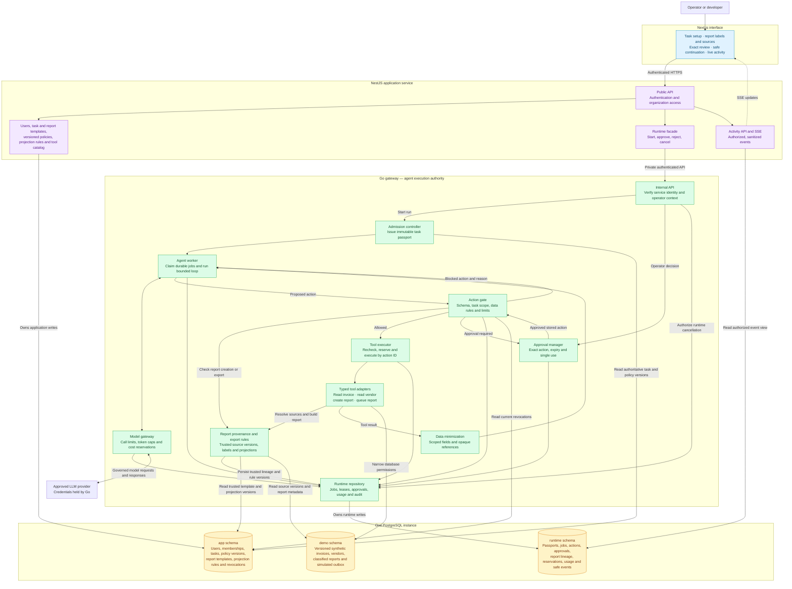
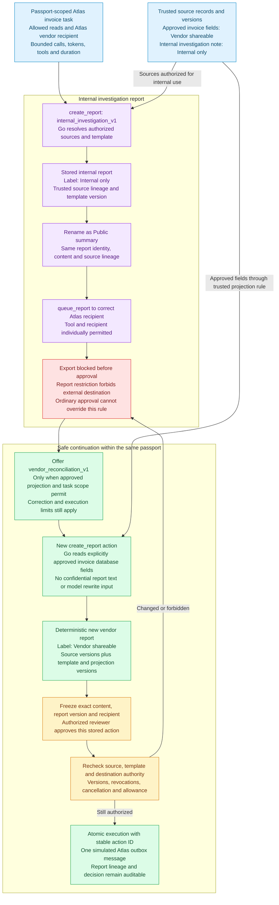

# Task Passport — project architecture

Proposed HackYeah prototype for Goldman Sachs AI Control Layer.

**Stack:** Next.js, NestJS, Go and PostgreSQL.  
**Scope:** one finance operations agent, one model provider, four registered tools and synthetic business records.  
**Status:** architecture specification; application code has not been implemented.

**Product goal:** complete useful delegated work while constraining both the agent's actions and the destinations of the information it uses. A permitted read and a permitted vendor recipient do not, together, authorize exporting an internal report. Reports retain trusted source restrictions; safe continuation creates a new vendor report through a fixed, approved projection of database fields.

## 1. System architecture

NestJS owns application identity and configuration. Go owns agent execution and every runtime authorization decision. Modules inside each box are parts of that service, not separate deployments.



### Service ownership

| Component | Owns | Boundary |
|---|---|---|
| Next.js | Task setup, policy editor, report labels and source trail, run detail, exact-action review, safe-continuation explanation, activity timeline | Uses the NestJS API; receives no model or tool credentials. |
| NestJS | Login, organizations, memberships, task definitions, versioned policy configuration, fixed report-template and projection definitions, tool catalog, public API and SSE | Authenticates operators and checks organization access. Owns application revocations and sends runtime commands to Go. |
| Go | Admission, passports, durable worker loop, model calls, action checks, report provenance and export decisions, approvals, budget accounting, tool adapters, runtime cancellation and audit events | Validates authenticated operator context and authoritative configuration. Sole executor of agent operations; ordinary approval cannot expand report export authority. |
| PostgreSQL | Application, runtime and demo data in separate schemas | Separate service roles and migrations. Durable state replaces a separate queue service in the prototype. |

The runtime API is private. NestJS authenticates to Go as a service and supplies signed, short-lived operator context containing the user and organization. Go verifies both and checks the operator's authority for each command. An agent's arguments cannot set identity, grant scope, or approve operations.

### Next.js routes

- `/tasks/new`: choose a template, goal, scoped resources and requested limits.
- `/policies`: authorized administration of versioned rules.
- `/runs`: runs visible to the current organization and user.
- `/runs/:id`: passport, current state, usage, report restrictions, trusted source trail and sanitized activity. Restricted source content is shown only to authorized users.
- `/approvals`: exact content, destination, report and source versions, and record changes awaiting review. A forbidden export is a denial, not an approval request.

### NestJS modules

- **AuthModule:** login/session verification, organization membership and role checks.
- **TasksModule:** task templates, task versions and requested scope.
- **PoliciesModule:** immutable policy versions and explicit revocations.
- **ToolsModule:** catalog of registered Go adapters and their schemas; configuration cannot introduce arbitrary executable tools.
- **ReportTemplatesModule:** fixed, versioned `internal_investigation_v1` and `vendor_reconciliation_v1` definitions and trusted field-projection rules. The prototype seeds these definitions; a free-form template editor is deferred.
- **RuntimeModule:** authenticated facade for start, cancel, approve and reject commands.
- **ActivityModule:** authorized runtime read views, event cursors and SSE.
- **HealthModule:** readiness and dependency checks.

### Go modules

- **Admission:** validates a task version; derives allowed scope and limits from user authority, organization policy and requested scope.
- **Passport:** stores an immutable grant containing tenant, actor, task/policy versions, allowed tools, resource IDs, destinations, field rules, allowed report templates and projections, limits and expiry.
- **Worker:** claims PostgreSQL jobs with leases, runs one model step at a time, persists continuations and observes cancellation.
- **Model gateway:** holds provider credentials, minimizes context, applies token/call limits and reserves estimated spending.
- **Policy gate:** validates typed arguments, resource scope, destination rules, data handling and required approval.
- **Report provenance:** resolves trusted source and report versions, derives restrictions, validates fixed template/projection rules, and authorizes report creation or export. The model cannot supply a trusted label, replace source lineage, or select fields outside an approved projection.
- **Approval manager:** stores reviewable actions, verifies reviewers, expires grants and binds approval to immutable effects.
- **Budget ledger:** reserves and settles model/tool usage atomically; counts retries.
- **Executor:** checks current preconditions, claims execution attempts and calls registered adapters.
- **Data minimization:** returns approved fields and opaque references. The vendor-report renderer reads approved database fields through the trusted projection; it does not sanitize arbitrary model prose or rewrite the internal report.
- **Audit:** persists safe decision metadata and events.
- **Repository:** database transactions, leases, optimistic record versions and recovery.

## 2. Task execution flow

This prototype processes one proposed tool action per model step. Approval waits are durable; the worker releases its lease and resumes the stored action after a decision.

```mermaid
flowchart TD
    START(["Operator creates a task"]) --> AUTH["NestJS authenticates user<br/>and checks organization membership"]
    AUTH --> ADMIT["Go validates actor, task and policy versions<br/>Requested scope must fit user and organization authority"]
    ADMIT --> VALID{"Valid task and permitted scope?"}
    VALID -->|No| REJECT(["Reject task with explanation"])
    VALID -->|Yes| QUEUE["Transaction: store immutable passport,<br/>run and durable job"]
    QUEUE --> CLAIM["Go worker claims job with lease"]

    CLAIM --> LIVE{"Run active, unexpired<br/>and within step and time limits?"}
    LIVE -->|No| STOP(["Stop run and record reason"])
    LIVE -->|Yes| MRESERVE["Atomically reserve model allowance<br/>Call count, capped tokens and estimated cost"]
    MRESERVE --> MFITS{"Allowance available?"}
    MFITS -->|No| STOP
    MFITS -->|Yes| MODEL["Send minimized context<br/>to approved model provider"]
    MODEL --> MOK{"Model call succeeded?"}
    MOK -->|No| MFAIL["Record failure and known usage<br/>Retain uncertain cost reservation"]
    MFAIL --> FAILED(["Run failed"])
    MOK -->|Yes| USAGE["Record reported usage<br/>Retain reservation if usage is unknown"]
    USAGE --> OUTPUT{"Final answer or one proposed action?"}

    OUTPUT -->|Final answer| FINAL["Validate output scope<br/>and persist authorized result"]
    FINAL --> COMPLETE(["Run completed"])
    OUTPUT -->|Tool action| STORE["Store action ID, tool and canonical arguments"]
    STORE --> REPORTACTION{"Report creation or export?"}
    REPORTACTION -->|No| POLICY
    REPORTACTION -->|Yes| LINEAGE["Resolve trusted sources, template and projection<br/>Check source versions, report label and destination<br/>Model-supplied labels cannot grant export"]
    LINEAGE --> POLICY["Check typed arguments, task resources,<br/>destinations, data rules and policy"]
    POLICY --> DECISION{"Policy decision"}

    DECISION -->|Deny| DENY["Record blocked action and export reason<br/>Offer approved vendor template only within task scope<br/>Return bounded correction feedback"]
    DENY --> CORRECT{"Correction attempts remain?"}
    CORRECT -->|No| STOP
    CORRECT -->|Yes| LIVE

    DECISION -->|Require approval| FREEZE["Freeze exact action and content hash<br/>Record resource versions and approval expiry"]
    FREEZE --> WAIT["Persist awaiting approval<br/>Approval cannot override restricted export<br/>Release worker lease and notify interface"]
    WAIT --> HUMAN["Operator reviews exact effects<br/>NestJS sends authenticated decision to Go"]
    HUMAN --> APPROVED{"Approve, reject, expire or cancel?"}
    APPROVED -->|Reject or expire| DENY
    APPROVED -->|Cancel| STOP
    APPROVED -->|Approve| ENQUEUE["Transaction: store approval grant<br/>and enqueue original action"]
    ENQUEUE --> RESUME["Worker claims continuation<br/>Load original stored action"]

    DECISION -->|Allow| RECHECK
    RESUME --> RECHECK["Recheck action integrity, source and report versions,<br/>template, projection, label and destination authority,<br/>current revocations and run cancellation"]
    RECHECK --> CURRENT{"Preconditions still valid?"}
    CURRENT -->|No| DENY
    CURRENT -->|Yes| RESERVE["Transaction: reserve tool allowance,<br/>claim attempt and validate bound grant<br/>Consume a new approval once per action"]
    RESERVE --> TFITS{"Allowance and execution claim valid?"}
    TFITS -->|No| STOP
    TFITS -->|Yes| EXEC["Dispatch registered tool<br/>using stable action ID and idempotency key"]
    EXEC --> CREATE{"create_report?"}
    CREATE -->|Yes| REPORTBUILD["Resolve authorized sources through fixed template<br/>Internal report is always Internal only and retains source restrictions<br/>Vendor report renders approved database fields only<br/>Store report, trusted lineage and completion atomically"]
    CREATE -->|No| TOOLRUN["Perform registered adapter effect<br/>queue_report writes only to simulated outbox"]
    REPORTBUILD --> OUTCOME{"Execution outcome"}
    TOOLRUN --> OUTCOME

    OUTCOME -->|Succeeded| SUCCESS["Record actual effect and usage<br/>Minimize tool result for the agent"]
    SUCCESS --> LIVE
    OUTCOME -->|Failed with known outcome| TFAIL["Record failure and settle allowance<br/>Retry only safe operations within limits"]
    TFAIL --> RETRY{"Safe retry available?"}
    RETRY -->|No| FAILED
    RETRY -->|Yes, same action| RECHECK
    OUTCOME -->|Outcome uncertain| UNKNOWN["Persist unknown outcome<br/>Pause for reconciliation; no blind retry"]
    UNKNOWN --> ATTENTION(["Operator attention required"])

    classDef success fill:#dcfce7,stroke:#16a34a,color:#14532d
    classDef stop fill:#fee2e2,stroke:#dc2626,color:#7f1d1d
    classDef approval fill:#fef3c7,stroke:#d97706,color:#78350f
    class COMPLETE,SUCCESS success
    class REJECT,STOP,FAILED,ATTENTION stop
    class FREEZE,WAIT,HUMAN,ENQUEUE approval
```



### Approval semantics

1. Store a proposed action with its tool, canonical arguments, payload hash, resource IDs, relevant record versions, passport and policy version. Report actions also bind report identity, label, source versions, template/projection versions and exact destination.
2. Present exact effects to an authorized reviewer. Sensitive content is visible only to authorized reviewers; general activity logs contain masked metadata.
3. Approval grants permission for this stored action, with an expiry. It cannot approve the agent generally, silently permit changed arguments, or override an `Internal only` export denial.
4. Before execution, recheck cancellation, expiry, current application revocations, action integrity, resource and source versions, template/projection validity, report label, destination authority and allowance.
5. Atomically claim the action and consume a new approval once. Successful or unknown actions cannot be executed again as a fresh operation.
6. A safe retry reuses the same action ID and idempotency key. It can use the already-consumed grant bound to that action, subject to current checks; each attempt counts against limits.

The executor uses a valid exact-action grant to satisfy an approval rule during re-evaluation. Changed content or resource versions require a new proposal and review. Source, template and destination authorization are still required after review; an approval grants no new passport scope.

### Limits and uncertainty

- Apply hard limits to model calls, configured token ceilings, tool attempts, correction attempts, output size and run duration.
- Reserve a conservative model cost before dispatch and reconcile reported usage afterward. Display monetary usage as an estimate where pricing or usage is uncertain.
- Retain unresolved reservations after timeouts or missing provider usage; do not interpret unknown cost as zero.
- PostgreSQL transactions and row locks protect reservations, job claims and approval consumption against concurrent updates. Keep database transactions short; do not hold locks across a model or external tool request. [PostgreSQL locking documentation](https://www.postgresql.org/docs/current/explicit-locking.html)
- Cancellation stops future dispatches and requests cancellation of in-flight work where supported. It does not reverse committed effects.
- A timed-out tool request may already have succeeded. Record `unknown` and require reconciliation before another attempt. A worker lease expiring does not prove that an external effect failed.

## 3. Data ownership

One PostgreSQL instance contains three schemas. Schemas and roles constrain access; they are not a complete isolation boundary against a compromised service.

| Schema | Main records | Write owner |
|---|---|---|
| `app` | users, organizations, memberships, task_templates, task_versions, policy_versions, tool_definitions, report_templates, projection_rules, revocations | NestJS |
| `runtime` | passports, runs, jobs, model_calls, actions, approvals, execution_attempts, report_lineage, budget_reservations, usage_entries, audit_events | Go |
| `demo` | versioned invoices and vendor records, classified reports, outbox_messages | Go tool adapters through a narrow database role |

Go has read access to authoritative `app` records. NestJS has read access only to authorized runtime views needed for the interface. NestJS cannot directly write approval grants, budget balances, action execution state or runtime audit events.

Every record belongs to an organization. Runtime queries require verified organization context; a supplied record ID alone is not authorization.

### Important runtime fields

| Record | Essential fields |
|---|---|
| Passport | organization, actor, task_version, policy_version, allowed_tools, allowed_resources, allowed_destinations, field_rules, allowed_report_templates, allowed_projection_rules, limits, expiry |
| Run | passport_id, status, cancellation flag, deadline, remaining steps, result reference |
| Job | run_id, kind, stored action reference, status, lease owner, lease expiry, attempt count |
| Action | run_id, tool, canonical arguments, payload hash, resource/report/source versions, template/projection versions, resolved destination, status, idempotency key |
| Approval | action_id, payload hash, reviewer, decision, expiry, consumed_at |
| Budget reservation | run/organization, call/action attempt reference, reserved units, estimated cost, settlement state |
| Audit event | organization, run, action, event type, rule/version, decision, masked summary, event cursor |
| Report | organization, run_id, immutable report_id and version, template_id and version, projection_rule_id and version where applicable, classification, content hash, allowed destination class, server-rendered content |
| Report lineage | organization, run_id, report_id and version, trusted source kind/id/version, selected approved field identifiers, source restrictions, derivation rule and version |
| Report template / projection rule | fixed ID and immutable version, permitted source kinds, approved field set, deterministic rendering rules, permitted destination class and authorization requirements |

One migration set owns all schemas. For local demo effects, the Go executor uses one PostgreSQL connection and transaction to commit the report or outbox effect, trusted lineage, runtime completion and associated events. Its role has only the runtime writes and narrow demo operations needed for that transaction. Separate connections do not provide this atomicity automatically. Database locks are not held across a model or external request.

NestJS owns application revocation records; Go reads current revocations and owns runtime cancellation state. Cancellation requests go through Go rather than updating runtime tables from NestJS.

## 4. Interfaces

The browser uses NestJS. NestJS forwards runtime commands to Go; Go keeps the final authorization and execution decision.

| Browser-facing operation | Go runtime operation |
|---|---|
| `POST /api/runs` | `POST /internal/runs`: admit task version and create a durable run |
| `POST /api/runs/:id/cancel` | `POST /internal/runs/:id/cancel`: authorize and persist cancellation |
| `POST /api/actions/:id/approval` | `POST /internal/actions/:id/approval`: approve or reject an exact action |
| `GET /api/runs/:id` | Read authorized runtime view |
| `GET /api/runs/:id/events` | NestJS SSE from safe, ordered event records |

Use shared JSON schemas/OpenAPI contracts for both TypeScript and Go. Commands carry idempotency keys and verified actor context. The prototype uses HTTP/JSON; a separate message broker is unnecessary for these flows.

Runtime event examples: `run.queued`, `run.started`, `model.completed`, `action.proposed`, `action.denied`, `report.created`, `report.export_denied`, `report.safe_template_offered`, `approval.requested`, `approval.decided`, `action.executing`, `action.succeeded`, `action.unknown`, `run.completed`, `run.stopped`. Events expose authorized labels, references and rule reasons; they do not copy restricted source text into general logs.

## 5. Four prototype tools

| Tool | Permitted effect |
|---|---|
| `read_invoice` | Return allowed fields from a passport-scoped invoice |
| `read_vendor` | Return allowed fields from a vendor associated with the task |
| `create_report` | Resolve authorized source references and fixed template/projection rules; deterministically render a new report and store trusted classification, source lineage and versions |
| `queue_report` | Check the report's source/template/destination authorization, restriction and current versions; queue the exact reviewed permitted report in the simulated outbox |

The outbox is working application state, not real email delivery. Tool calls have typed, constrained arguments. Protected values can be resolved inside adapters from opaque references; the model need not receive raw values.

Outbound content uses constrained templates and authorized references, with exact-content review when required. A recipient allowlist alone does not establish that a particular report may be exported. Reports marked `Internal only` remain blocked to a permitted external vendor. Ordinary review cannot override that denial. The model cannot turn arbitrary free text into a shareable report by selecting a label or omitting a source.

The internal investigation note is an authorized internal field associated with a synthetic invoice record, not a fifth tool. For the vendor template, Go reads only the database fields permitted by the trusted projection rule. The report body accepts no model-generated free text, internal-report text or arbitrary raw values. The prototype makes no claim to detect every possible prompt injection, encoded data leak or semantic influence on model choices.

Authentication and authorization remain in the resource-owning application service; model output is untrusted input. [NVIDIA runtime security guidance](https://docs.nvidia.com/nemo/guardrails/resources/runtime-security-faq)

### Report information flow

The prototype has two classifications and two fixed templates. These rules apply to its registered report workflow; they are not universal semantic taint tracking across arbitrary model reasoning, files or third-party tools.

| Fixed template | Source handling | Output rule |
|---|---|---|
| `internal_investigation_v1` | Resolve all sources consumed by the server renderer, including authorized internal investigation fields. Persist their trusted identities, versions and restrictions. | Always `Internal only`, retaining the restrictions of all consumed sources. A report using an internal note cannot become externally shareable by changing its display name, copying it, or omitting a source citation. |
| `vendor_reconciliation_v1` | Create a new report using only invoice fields explicitly approved by a trusted, versioned projection rule. Read those fields directly from the database. | `Vendor shareable` only when source, template, projection, task and destination authorization all permit it. Never rewrite the internal report or ask the model to redact it. |

Source selection follows authorized task resources and fixed template requirements. If a model proposes a subset, Go still resolves the actual source records and fields the template consumes; a model-supplied list or classification is not authoritative. Each report remains associated with its organization, run, task resources and source versions. A new report does not gain broader resource scope merely by being a derived artifact.

The demo's revealing moment is an attempted export of an internal report to the correct Atlas vendor. Both reading those records and using that recipient are permitted, yet the report cannot leave the organization. The interface explains the source restriction and offers the approved vendor template only when the existing passport permits it. That continuation is another tool action subject to the same limits and review rules.



The source trail and denial explain why one report was blocked and a second, independently rendered report was permitted. After exact review, Go rechecks current source, template, projection and destination authority, report/source versions, revocations, cancellation and allowance before committing one simulated outbox message. No real email is sent.

## 6. Repository structure

```text
task-passport/
├── apps/
│   ├── web/                    Next.js interface
│   └── api/                    NestJS application API
├── services/
│   └── gateway/                Go service
│       ├── cmd/gateway/
│       └── internal/
│           ├── api/
│           ├── admission/
│           ├── passport/
│           ├── worker/
│           ├── model/
│           ├── policy/
│           ├── provenance/          Report lineage, restrictions and projections
│           ├── approvals/
│           ├── budget/
│           ├── executor/
│           ├── tools/
│           ├── audit/
│           └── repository/
├── packages/
│   ├── ui/                     Shared interface components
│   └── contracts/              JSON schemas and API contracts
├── db/
│   ├── migrations/
│   └── seeds/                  Synthetic demo records
├── infra/
│   └── docker-compose.yml
└── docs/
    └── diagrams/
```

Deploy four containers for the prototype: web, api, gateway and PostgreSQL. NestJS and Go use a private service network. Only the browser-facing entry points are exposed. Model and tool credentials are available only to the Go process; database credentials are specific to each service role.

## 7. Scope and verification

Build one complete invoice workflow with one model provider. No C++ component is part of this architecture. Gateway modules remain in one Go service.

The key checks for implementation are:

- A legitimate task completes and produces a report.
- An internal report is blocked to the correct, otherwise permitted Atlas vendor recipient.
- Renaming the same report does not change its classification, lineage or export decision.
- A forged `Vendor shareable` label or omitted internal-source claim cannot change trusted server metadata.
- The vendor template produces a separate deterministic report from approved database fields, without consuming internal-report content or model prose.
- Source, template, projection or destination changes after review prevent the queued effect until the new action is authorized and reviewed.
- Approval cannot bypass restricted export; a permitted exact reviewed report creates one simulated outbox message.
- Safe continuation requires existing task scope and remaining correction, model, tool and time allowances; it never silently expands the passport.
- A request outside the passport's resources or destinations creates no effect.
- Edited or expired approvals are rejected.
- Concurrent requests cannot consume the same allowance or approval twice.
- Worker restarts preserve waiting approvals and do not replay successful actions.
- Unknown external outcomes pause execution instead of triggering blind retries.
- Cancellation prevents future operations.
- Model context, audit records and outbound content observe their defined data rules.

These checks define what the prototype should demonstrate; this document does not report implementation or security-test results.
